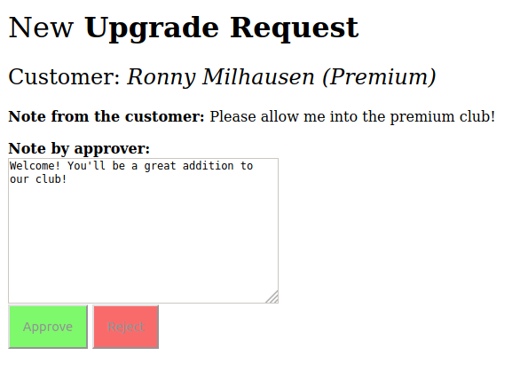

# Mysterious bugs

Repository reproducing some bugs I've encountered.

## 1. Failing approval

There are "Standard" and "Premium" customers. The customer can write
an "Upgrade Request" with a note and ask to belong to the "Premium" class.
The support staff is then reviewing all pending requests (handily displayed at
[the root URL](http://127.0.0.1:8000/) without any authentication).

However, sometimes, they end up with a request that is still pending (the 
"New" state), but the customer already belongs to the "Premium" class. 
The following image illustrates the case. The Upgrade Request stays in the "New"
state, but the customer is already in "Premium". 



Because we care about data
integrity, we won't allow the upgrade to happen twice, and the Approve/Reject
buttons are disabled. Then our staff is quite upset because these zombie
requests are still pending in their queue.

**Can you figure out how this can happen and how to fix it?**

You'll need:

1. PostgreSQL database (tested with PostgreSQL 10, but it should be fairly version-independent).
   SQLite works differently.
   
2. Import the initial fixture:

   ```
   ./manage.py loaddata initial
   ```

